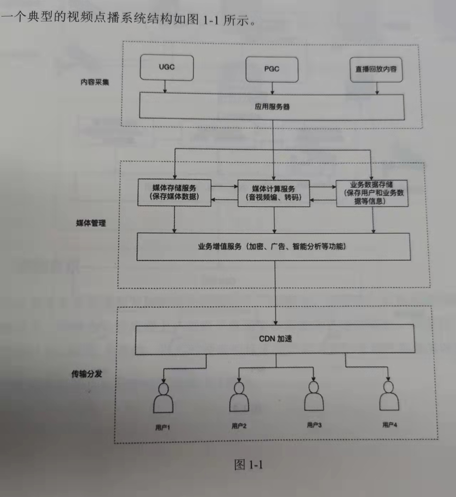
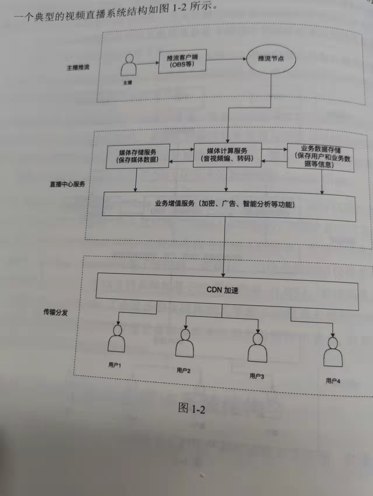
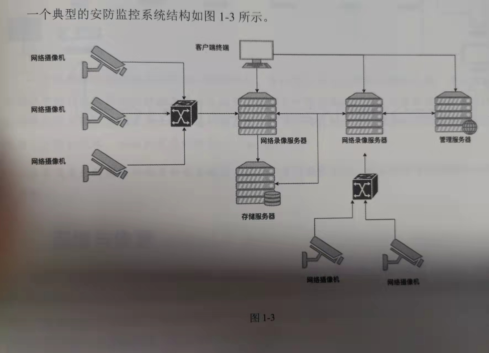
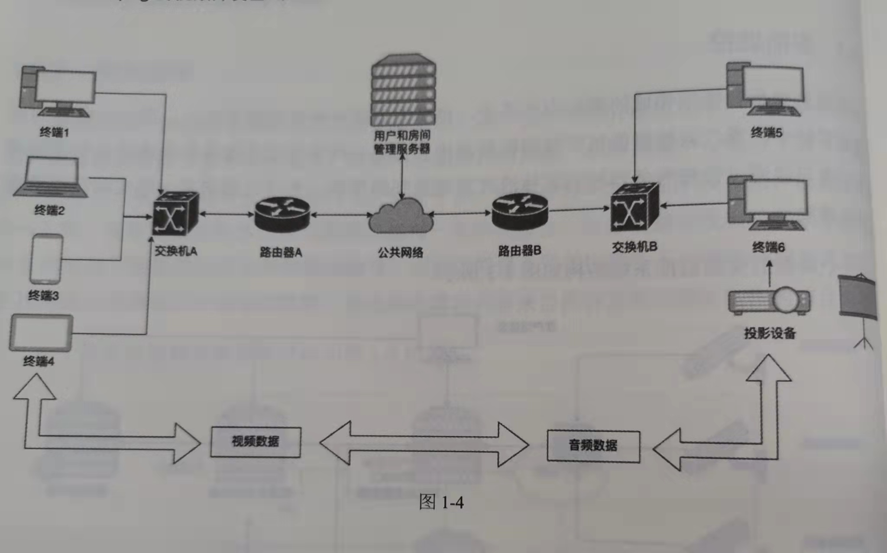

## 01-音视频技术概述
### 1.1 音视频信息与多媒体系统
    常用的开源工程有FFmpeg、GStreamer、WebRTC、LAV Filters
    技术瓶颈主要有以下几点：
        1.设备运算能力限制
            运算能力不足会出现延迟
        2.数据传输带宽限制
            带宽不足影响显示质量和响应速度
        3.显示设备设计限制
            普通小屏显示，对视觉的生理成像机制适应性不足
### 1.2 典型的音视频与多媒体系统结构
#### 1.2.1视频点播
    VOD(Video On Demand)视频点播
    PGC 专业内容生产
    UGC 用户生成内容
    CDN 内容分发网络

#### 1.2.2视频直播

#### 1.2.3安防监控

#### 1.2.4
    许多基于公网的视频会议系统都以WebRTC为基础，以尽可能低的延迟提供高质量的音频和视频实时通信服务
 