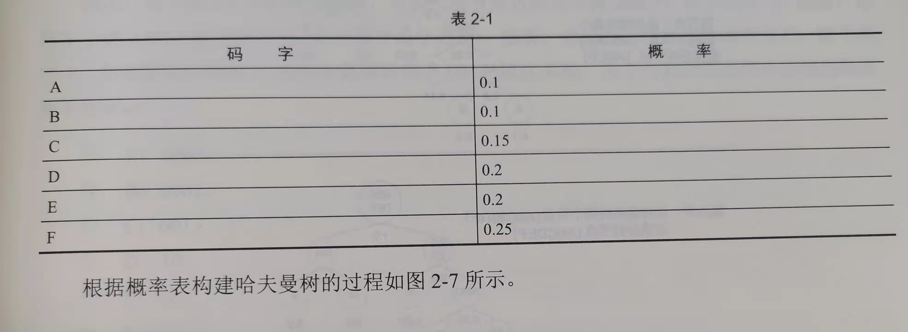
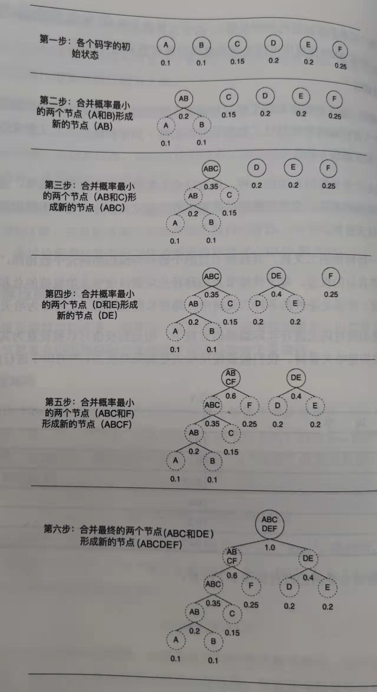
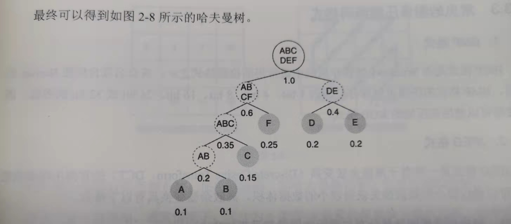
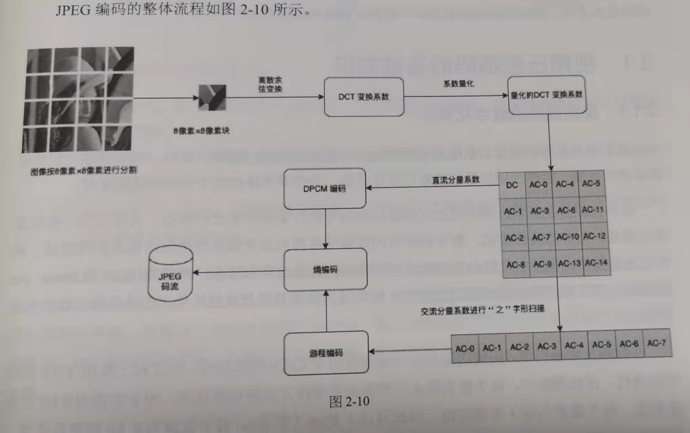

## 02-图像、像素与颜色空间
    一个连续播放的视频文件是由一串连续的、前后存在相关关系的图像构成的，
    并通过连续的图像中的内容以及图像间的相互关系表达整个视频文件所包含的信息。
    这些组成视频基本单元的图像被称为帧，其在本质上与普通的静态图像没有任何区别，
    只是在进行压缩编码的过程中使用了不同的技术，以达到更高的效率
### 2.1 图像与像素
    图像一般值静态图像，图像是一种在二维平面上通过排列像素(Pixel)来表达信息的数据组织形式
    像素是构成图像的基本单元，每个像素都表示图像中一个坐标位置上的亮度或色彩等信息
    
    实际场景中，图像通常分为彩色图像(Color)和灰度图像(Gray)两种。
    彩色图像中，每个像素都由多个颜色分量组成
    灰度图像中，每个像素都只有一个分量用来表示该像素的灰度值

    彩色图像转灰度图像：
    matlab    
        Gray=0.2989*R+0.5870*G+0.1140*B
    opencv    
        cvtColor(imgRGB,imgGray,COLOR_RGB2GRAY)
### 2.2 图像的位深与颜色空间
    对于灰度图像，在每个像素点上只有一个分量，即该点的亮度值。
    通常数据长度有8bit或者10bit两种。8bit[0,255] 10bit[0,1024]

    对于彩色图像，其每个像素点都包含多个颜色分量，每个颜色分量被称为一个通道(Channel)
    以RGB图像为例，如果每个通道的位深都是8bit，则每个像素需要24bit(8bit*3)，
    如果还包含图像透明度Alpha通道，则图像为ARGB，每个像素需要32bit(8bit*4)

    确定图像的位深后，根据图像的高、宽尺寸可以确定图像的数据体积。
    如：RGB图像1920*1080 则体积为
$$
(8bit*3)*(1920*1080)=6220800B \approx 6.22MB
$$

    RGB格式的图像更适合用来显示，而不适合在图像处理系统中。
    因此针对不同的场景有不同的彩色数据表达方式，即颜色空间
    颜色空间是一种利用整数区间来表示不同颜色的模型，其维度可以分为一维、二维、三维甚至更高维
    常用的三维空间有：RGB、CIEXYZ、YUV、HSV
    
    RGB (0,0,0)表示纯黑 (MAX,MAX,MAX)表示纯白。由于每个颜色都与三个分量相关，
    并且各个分量之间不存在主次关系，所以无法针对次要信息进行特定的亚采样。因此不适用于视频信号压缩编码
    YUV Y亮度分量 UV色度分量。色度分量的采样率可以等于或低于亮度分量
    在讨论图像与视频压缩场景下，通常默认YUV格式可等价于YCrCb格式。

    RGB与YUV互转 R,G,B[0,255] U,V[-128,128]
    RGB--->YUV
    matlab  
        Y=(77*R+150*G+29*B)>>8 
        U=((-44*R-87*G+131*B)>>8)+128 
        V=((131*R-110*G-21*B)>>8)+128
    opencv  
        cvtColor(imgRGB,imgYUV,COLOR_RGB2YUV_I420)
    YUV--->RGB
    matlab  
        R=Y+((360 * (V-128))>>8) 
        G=Y-(((88*(U-128)+184*(V-128)))>>8) 
        B=Y+((455*(U-128))>>8)
    opencv
        cvtColor(imgYUV,imgRGB,COLOR_YUV2RGB_I420)
### 2.3 图像压缩编码
    多种图像压缩算法，根据压缩后是否存在信息损失分为无损压缩和有损压缩两大类
    无损压缩：TIFF、BMP、GIF、PNG
    有损压缩：JPEG
    
    各种图像压缩算法均非单一的算法，而是若干不同算法的组合，以此尽可能的提升数据的压缩效率
    无损编码中常用的：
        游程编码
            特别适合处理信息元素集合较小(如二值化的图像，只包含0和1两个信息元)的信息
            游程编码压缩数据量的主要思路是将一串连续的、重复的字符使用“数目”+“字符”的形式表示
            如：
                AAAAABBCCCCCCDDAEE --->5A2B6C2D1A2E
            在图像与语音信号中，出现连续字符的情况较为常见(如语音中用连续的0表示静默音频、图像中的单色或者相近色的背景等)
            BMP图像中可选游程编码对像素数据进行压缩
        哈夫曼编码
            哈夫曼编码是可变长编码方式的一种，该方法完全依赖于码字出现的概率，
            是一种构造整体平均长度最短的编码方式，关键步骤就是建立符合哈夫曼编码规则的二叉树(哈夫曼树)
            哈夫曼树是一种特殊的二叉树，其终端节点的个数与待编码的码元个数相同，而且在每个终端节点上都有各自的权值
            每个终端节点的路径长度乘以该节点的权值的总和为整个二叉树的加权路径长度。
            在满足条件的各种二叉树中，路径长度最短的二叉树即为哈夫曼树
            实际编码中，码元的权值可以设置为其概率值

            得到哈夫曼树后，便可以得到每个码元的哈夫曼编码的码字，具体方法是：从哈夫曼
            树的根节点开始遍历，直至每个终点节点，当访问某节点的左子树时赋予码字0,
            当访问其右子树的时赋予码字1。直到遍历到终端节点，这一路径所代表的0和1的串
            便是该码元的哈夫曼编码码字
            上图的哈夫曼树，得到的编码码表：
            A：0000  
            B：0001 
            C：001 
            D：10 
            E：11 
            F：01
            从码表可以看出另外的一个规律，就是任意一个码字都不可能是其他码字的前缀。
            因此哈夫曼编码的信息可以紧密排列且连续传输，而不用担心解码时出现歧义。

            常见的图像压缩编码格式
            BMP Bitmap 可以保存位深为1bit、4bit、8bit、24bit或者32bit的图像，图像数据可以使用未压缩的RGB格式
            JPEG 基于离散余弦变换(Discrete Cosine Transform DCT)的有损压缩编码格式
                可以通过较小的数据损失获得较小的数据体积。离散余弦变换具有以下特点：
                1 变换后的频域能量分布与实际的图像信号更加吻合
                2 更容易兼容硬件计算，运算更高效
                把一副未压缩的图像压缩成JPEG格式的主要流程：
                1.把像素格式的图像数据转换为YUV格式，并对两个亮度分量进行亚像素采样，最终生成4：2：0格式的图像数据
                2.针对每个YUV格式的图像数据分别进行处理，将每个分量的图像等分为8像素*8像素的像素块
                3.对于每个8*8的像素块，都使用离散余弦变换将像素数据变换为值频域，并根据给定的量化表将变换系数量化为特定值
                4.对于某个分量图像的所有像素块，对其变换量化后的直流分量系数通过DPCM编码，
                    在交流分量系数通过“之”字型扫描转换为一维数据后，再通过游程编码进行处理。
                5.对于处理后的变换系数，使用熵编码(哈夫曼编码等)生成压缩码流输出

