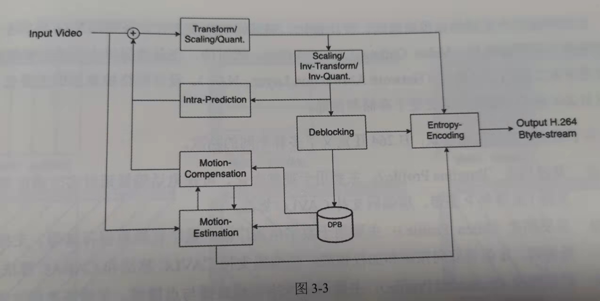
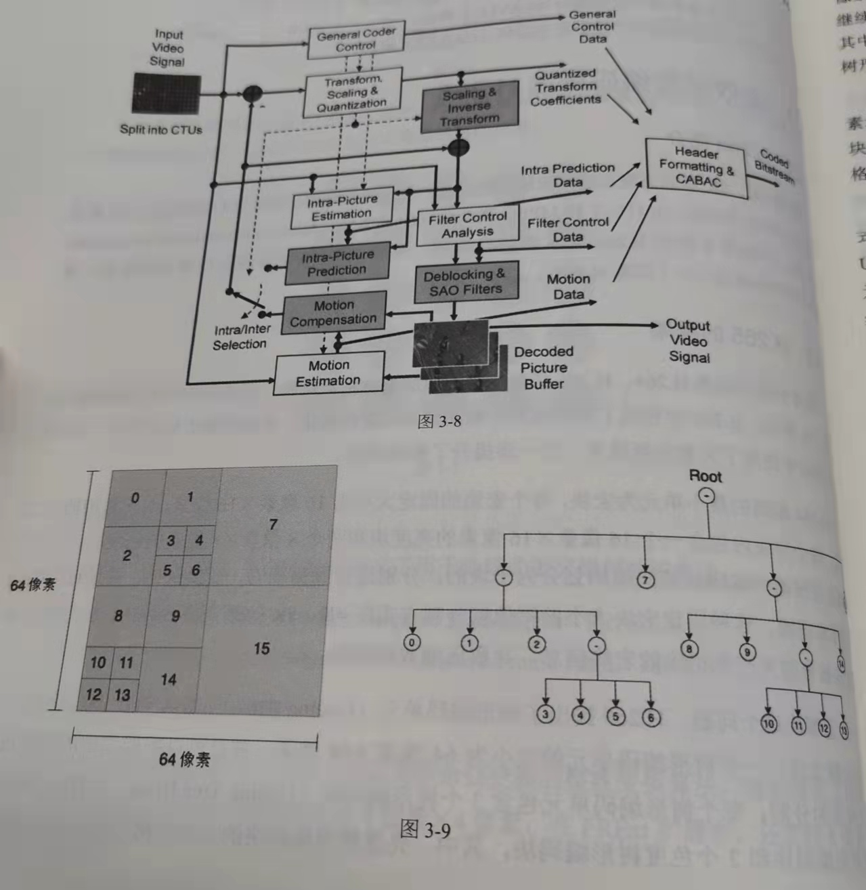

## 03-视频压缩编码

### 3.1 视频压缩编码的基础知识
    与静态图像类似，数字视频中每幅图像都由呈平面紧密排列的像素矩阵组成，被称为视频帧，
    视频中每秒内容u所包含的视频帧的数量称为帧率，单位fps(frame per second)
    在视频压缩编码中，图像的颜色空间通常使用YCrCb颜色空间，在工程上常用YUV颜色空间指代
    在视频帧中，每个像素所占的字节数由其采样方式和位深决定

    YUV像素格式 
    4：4：4 每1个Y均对应1个U和1个V 
    4：2：2 每2个Y对应1个U和1个V
    4：2：0(又称4：1：1) 每4个Y对应1个U和1一V
    使用这种方式的主要原因是人的感官对于亮度信息的敏感度远高于对色度信息的敏感度，
    因此相对其他像素格式，YUV像素格式的最大优势就是可以适当地降低色度分量的采样率，并保证不对图像造成太大影响
    
    从数字视频采集设备中获取的原始图像信号需要转换为某中间格式后，可能进行编码和传输等后续操作
    通用中间格式(Common Intermediate Format CIF)为其他格式的基准，
    其他常用格式：
    QCIF        176*144 移动多媒体
    CIF         352*288 视频会议与可视电话
    4CIF/SD     720*576 标准清晰度 标清数字电视广播和DVD
    HD/720P     1280*720 高清晰度 高清数字电视广播和蓝光DVD
    FHD/1080P   1920*1080 全高清晰度 高清数字电视广播和蓝光DVD
    UHD         3840*2160(4K) 7680*4320(8K) 超高清晰度 超高清数字电视和高端数字娱乐系统
### 3.2 视频压缩编码标准的发展历程
    从事视频编码算法的标准化组织
    ITU-T Internatial Telecommunication Union - Telecommunication standardization sector
    ISO International Standardization Organization
    较强影响力的标准    MPEG-2 H.264 H.265等
    比较有影响力的标准   VP8/VP9 VC-1 AVS AVS+ AVS2
### 3.3 视频压缩编码的基本原理
    像素格式的视频数据之所以能被压缩，其根本原因在于视频中存在冗余信息
    视频数据中的冗余信息主要有：
    1.时间冗余 视频中相邻两帧之间的内容相似，存在运动关系
    2.空间冗余 视频中某一帧内部的相邻像素存在相似性
    3.编码冗余 视频中不同数据出现的概率不同
    4.视觉冗余 人的视觉系统对视频中的不同部分敏感度不同

    在视频编码中
        预测编码：
            帧内预测：根据当前帧已编码的数据进行预测，利用图像内相邻像素之间的相关性去除视频中的空间冗余
            帧间预测：将部分已编码的图像作为参考帧，利用前后帧之间的时间相关性去除视频中的时间冗余
        变换编码：
            主要方法是离散余弦变换及其优化算法
        熵编码：
            在信息学领域，熵用来表示信息的混乱程序或相关性，熵越高，信息越无序、越不可预测。
            常用熵编码算法：
                UVLC 指数哥伦布编码 常用于帧与Slice头信息的解析过程
                CAVLC 上下文自适应的变长编码 主要用于H.264的Baseline Profile等格式的宏块类型、变换系数等信息
                CABAC 上下文自适应的二进制算术编码 主要用于H.264的Main/High Profile和H.265等格式的宏块类型、变换系统等信息

### 3.4 视频编码标准H.264
    严格来说，H.264是MPEG-4家族的一部分，即MPEG-4系列文档ISO-14496的第10部分。因此又被称为MPEG-4 AVC

### 3.5 高效视频编码标准H.265
